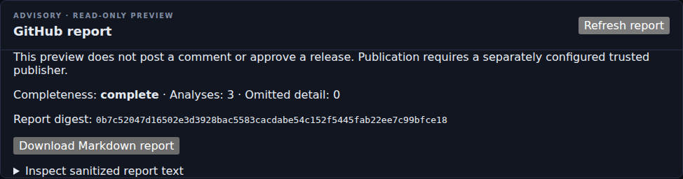

# Loose Thread
## Evidence-Grounded Test Failure Triage and AI Evaluation

**M6.4 diagnostic development:** the existing pipeline now supports scoped
transfer-atomicity, tenant-isolation, status-expectation and runner-memory
observations, independently revalidated claims, and reviewer-visible diagnostic
gaps. A richer companion probe and explicitly developmental campaign preserve
all historical test data and failures. This is not completed M6 or renewed
held-out quality acceptance. [Contracts, execution scope and reproduction](docs/diagnostic-quality.md). [Executed M6.4 evidence and limitations](docs/M64-DELIVERY.md).

Loose Thread is a self-hosted platform for investigating automated-test failures using inspectable evidence. Its default analyzer is deterministic and CPU-only; no paid model API, GPU or runtime model download is required.

**Retained M6.3 checkpoint: structured diagnostic contracts and frozen five-category campaign. Full M6 and the complete project remain PARTIAL.** The new corpus is committed before test evaluation. Exact-source measurements, CI and limitations are recorded in the [delivery ledger](docs/PROGRESS.md), [requirement matrix](docs/requirements-matrix.md), and [campaign contract](docs/campaign-evaluation.md). Historical reports retain their originally tested revisions.

The reconciled source also retains the separately authored M6.3 `domain-observations-v1` path and its `benchmark-v1` evaluation harness. It is exposed independently from the campaign so neither dataset nor metric lineage is silently substituted for the other. The retained `benchmark-v1` frozen measurement covers 260 cases / 83 authored groups with 108 family-separated test cases and reports **0/44 product recall, macro F1 0.3048, 19.57% non-abstained coverage and 0/44 dangerous dismissals**. Recall, F1 and coverage fail the unchanged targets; all 44 test product cases abstain. [Benchmark contract and limitations](docs/benchmark-evaluation.md) · [Exact retained benchmark report](evaluation/reports/benchmark-v1/report.md).

The retained M6.1 LedgerGuard challenge executes **60 real production-component interventions across 15 mechanisms**, each with a healthy control. Their reports traverse Loose Thread's API, durable worker, PostgreSQL and evidence validator. The result is **48/60 product defects recognized, 12 abstentions and 0/60 dangerous dismissals**. The unchanged 90% recall target **FAILS**. This is not LedgerGuard HTTP/database transaction verification, a five-category held-out benchmark or a deployment guarantee.

## New frozen evaluation campaign

The mixed-source dataset contains **264 cases in 87 agent-reviewed family groups**.
Its **160-case test split is entirely synthetic** and family-disjoint from development/calibration.
The sixty retained actual LedgerGuard component cases remain development evidence;
replaying them is not a new companion execution. Twelve new structured-measurement
supplements exercise operation-scoped fingerprints, stale projection ordering and
weekly calendar recurrence without inventing missing measurements in old artifacts.

The same API, durable worker, evidence validation and dashboard evaluate these
cases. Prior reviewed synthetic flake history is persisted, while seeded future
reviews must be excluded. The independent scorer retains exact source/input
digests, five repeated decisions, baselines, a five-class confusion matrix and
all failures. No thresholds are weakened. See [reproduction and limits](docs/campaign-evaluation.md).

## Verified operational and report workflows

At source `8eb264d`, [all twelve ordinary CI jobs](https://github.com/azerish25-ux/ai-quality-intelligence/actions/runs/36775868918)
passed, including real PostgreSQL, producer fixtures, four browser lanes, non-root
application containers, isolated runtime networking and actual database/artifact
backup restore with citation validation. The backend passed 2,365 tests with no
skips and 89.44% combined statement/branch coverage. Actual branch-only coverage is
80.86%; the separate 90%/95% acceptance job correctly fails, keeping the workflow
red. This certifies the named ordinary regression scope, not an
unmeasured later commit. Frozen classifier quality targets still fail as described
above; operational correctness is not a replacement for diagnostic acceptance.
This checkpoint repairs current API/report and human-review evidence validation,
expired historical support, upload cleanup and trace rejection. Further provider
boundary review is recorded in the [delivery ledger](docs/PROGRESS.md); passing
ordinary tests do not establish complete security or current-evidence coverage.

The [bounded telemetry contract](docs/telemetry.md) covers durable trace context,
fixed-cardinality metrics and default-disabled export. Its optional local-only
collector/viewer profile passed real Docker verification at repair `8daa5c7` in
[36687923599](https://github.com/azerish25-ux/ai-quality-intelligence/actions/runs/36687923599).
The strict 50,000-execution read benchmark has both passing and failing shared-runner
measurements; `8eb264d` passed at 457.72 ms p95 on an Intel runner after the
runtime-identical `be7eede` failed at 607.66 ms on AMD. All four cold and 200 warm
requests succeeded in both measurements. Stable compliance with the
unchanged 500 ms target remains open. [Measurements and limits](docs/operational-benchmark.md).

New workflows include an [authorized read-only GitHub report preview](docs/github-publication.md),
[a bounded optional-provider proposal boundary](docs/optional-provider.md), and
[100-run synthetic history](docs/synthetic-history.md). See the concrete
[known-failure catalog](docs/limitations.md) and [contributor guide](CONTRIBUTING.md).

The optional provider workflow now includes scoped evidence previews, explicit
administrator approval, durable job status/cancellation and a separate isolated
worker deployment. It is disabled by default and rejects demo deployments. Synthetic
PostgreSQL, desktop/narrow browser and Docker topology tests pass at `caee9e3`.
No real model or paid-provider quality result
is claimed. [Configuration, trust boundaries and verification limits](docs/optional-provider.md).

Actual API-backed report captures at earlier verified source `3a9a89a`, using synthetic demo data:



[Open the narrow-screen report capture](docs/assets/report-narrow-3a9a89a.png).
[Capture provenance and artifact digests](docs/assets/provenance.json).

## Start the stack

```bash
docker compose up --build
```

The default loopback-bound synthetic-demo stack exposes the dashboard at `http://localhost:8080` and API documentation at `http://localhost:8000/docs`. Use **Load synthetic demo**, then upload a supported artifact or manifest ZIP through **Durable pipeline**. Processing and input diagnostics come from persisted API state, not simulated streaming.

Evidence storage requires the Linux/container filesystem capabilities described in
[safe binary evidence](docs/safe-binary-evidence.md): directory-relative no-follow
operations and exclusive hard links on the artifact filesystem. Unsupported
storage fails explicitly. The configured artifact root remains operator-trusted.

The evaluation panel defaults to the [retained exact-source measured report](evaluation/reports/ledgerguard-component-v1-7405d923/report.md). It displays the revision actually measured, not the current runtime revision. CI mounts its own fresh exact-revision report. All failures and unknown metrics remain visible.

**Before upgrading existing data**, review [retention and account lifecycle](docs/operations-lifecycle.md) and [trace-text upgrade guidance](docs/safe-binary-evidence.md). Default retention is seven days for restricted sources, ninety days for evidence bodies and 365 days for project audit events. Expiry is irreversible. Existing immutable trace derivatives are not automatically rewritten by later sanitization policy.

Production mode requires `FAILURELENS_DEMO_MODE=false`, a configured bootstrap administrator with a non-placeholder password of at least fourteen characters, and `FAILURELENS_SESSION_COOKIE_SECURE=true`. Do not expose the demo configuration as production. Administrators create project-scoped ingestion credentials; plaintext is shown only once. See [security and trust boundaries](docs/security.md).

## What works

### Durable execution path

FastAPI and typed schemas expose upload, processing, runs, investigations, reviews and operational status. SQLAlchemy/Alembic persist explicit relational records in PostgreSQL. Jobs use transactional claims, leases, heartbeats, bounded retries, cancellation and recovery. The normal report-to-analysis path needs no second analysis request.

Uploads use bounded private storage, safe filenames and content digests. Reimporting the same run/input is idempotent; distinct legitimate runs are not merged merely because their bytes match. Human sessions and ingestion tokens are stored as hashes. Viewer, reviewer and administrator roles are project-scoped, with server-derived actors and optimistic concurrency for human decisions.

### Manifest `2.0` and honest completeness

A ZIP can contain a root `manifest.json` declaring expected artifacts and shards. Required/optional inputs persist as `accepted`, `restricted`, `missing`, `rejected` or `unsupported`. Completeness counts required inputs, not test observations: a report containing 500 tests is still one input. Missing or rejected required evidence cannot yield reassuring complete-scope advice. Legacy single-report bundles remain supported.

### Evidence adapters

The registry supports documented depths for Playwright JSON, JUnit XML, pytest-json-report, REST Assured/JUnit exchange evidence, k6 handleSummary JSON, console text/JSONL, HAR/network JSONL, PNG/JPEG screenshots, version-pinned Playwright traces, GitHub metadata and changed-file lists.

Actual producer fixtures exercise Playwright, Pytest, REST Assured/JUnit and k6. Screenshots have bounded decoding and attributable review/masking; approved derivatives contain opaque burned-in masks. Traces expose bounded sanitized events with exact entry/line citations, not executable DOM replay. Originals remain restricted. Safe content endpoints verify authorization, approval, source/derivative digests and expiry. [Compatibility matrix](docs/input-compatibility.md) · [Binary evidence contract](docs/safe-binary-evidence.md).

### Safety and analysis

The five categories are `product_defect`, `test_defect`, `infrastructure_failure`, `known_flake` and `insufficient_evidence`. Scores identify their heuristic semantics. A retry pass does not prove harmlessness; a timeout does not establish a flake. Missing evidence or contradictions can require abstention.

A separate publication validator checks project/run/execution scope, immutable derivative digests, locations, quotations, typed observations and supported claims. Invalid claims are withheld or degraded safely. Redaction and restriction precede analysis. Automatic sanitization is incomplete, especially for arbitrary pixels and unknown identifiers.

Fingerprints and clusters expose matching/conflicting signals, conservative grouping and revision history. Prior-only test history collapses retries, reports actual denominators and preserves unknown/skipped outcomes. Known-flake reassurance requires qualifying reviewed history. Independently recorded infrastructure events provide compatible associations, not causal proof.

Change-impact recommendations use trusted mappings, mandatory critical tests, explained selections/exclusions and full-suite fallbacks. Performance comparisons require compatible workloads, units and baselines; missing baselines and insufficient measurements remain explicit. Reviewers can record corrections without erasing earlier machine output or decisions.

### Dashboard and integrations

The API-backed dashboard includes run/upload status, cited evidence, clusters, history, impact overrides, performance, infrastructure context, review queues, audit filtering/export, roles, tokens, retention and account/session management. Investigation URLs preserve selected runs and filters. Desktop and narrow layouts have keyboard/focus and real browser coverage.

The reusable composite Action uses the same ingestion and report path, with bounded
sanitized evidence exports that can survive its temporary database. Rich reports
include stored skip, impact, cluster, performance and conservative baseline details.
The separate publisher now records durable intents/receipts, verifies bot identity
before writing, and fences uncertain or stale outcomes. Synthetic contract and hosted
PostgreSQL/browser tests pass at `48e6336`; authorized live PR publication remains
unverified. The analyzer never deletes tests, merges PRs, approves releases or
executes quarantine decisions. [Integration and current limits](docs/github-publication.md).

## Evaluation truthfulness

These separate classification datasets must not be conflated:

| Dataset | What it establishes | Limitations |
|---|---|---|
| Legacy 200-case synthetic corpus | Historical rule-regression behavior | Its 100 family identifiers collapse to five recurring templates crossing all three splits; not independent held-out diversity |
| M6.1 60-case LedgerGuard challenge | Actual production-component controls/interventions and full Loose Thread ingestion/evidence replay | Fifteen mechanisms, four dependent variants each, only product-defect labels, public agent-authored challenge |
| M6.3 frozen corpus | 260 cases in 83 authored mechanism groups, 108 family-separated test cases through the real API/worker | Test cases are synthetic; 60 historical executions remain development-only; quality targets fail |

The component-only panel leaves five-category macro F1 undefined rather than inventing a favorable score. Product recall is 80%, below the 90% target. All twelve abstentions remain visible. Zero observed dangerous dismissals is not proof of zero real-world risk. Labels are agent-reviewed, not independently expert-adjudicated. No external model was invoked; compute cost was not measured.

The earlier clustering, impact, performance and infrastructure suites remain separate synthetic regression fixtures. Their historical results are preserved under `evaluation/reports/latest/`; they do not establish deployment performance, observed runtime savings or independent causal validity.

### Reproduce the executed evaluation

The [execution contract](docs/ledgerguard-evaluation.md) specifies the pinned companion, disposable database setup, exact commands, isolation, output boundaries and limitations. The permanent `ledgerguard-evaluation` CI job runs:

```bash
python integrations/ledgerguard/run.py --ledgerguard-source /path/to/pinned-ledgerguard --output /tmp/failurelens-m6/corpus
python evaluation/replay.py --inputs /tmp/failurelens-m6/corpus/inputs --output /tmp/failurelens-m6/replay --repeats 5 --confirm-disposable-database
python evaluation/executed_harness.py --corpus /tmp/failurelens-m6/corpus --replay /tmp/failurelens-m6/replay --output /tmp/failurelens-m6/report
```

This requires JDK 21, the installed backend dependencies, the pinned companion checkout and a migrated empty disposable PostgreSQL database with synthetic demo mode enabled. Output directories refuse overwrite. The replay process does not load benchmark labels. Its file-open audit tripwire is not an operating-system sandbox.

The normal scorer enforces execution integrity and safety; quality targets are reported separately and remain visible in CI and the dashboard. Add `--enforce-quality` with a new output directory to fail with exit 2 when a quality target is missed. A green scoped execution job is not full M6 acceptance.

The compact original controlled-data archive and reports are also retained in Git. After installing backend dependencies, verify and rescore them offline with:

```bash
python evaluation/verify_snapshot.py
```

This verifies historical bytes and results; it does not pretend to perform a fresh Java/PostgreSQL execution. [Retained provenance](evaluation/reports/ledgerguard-component-v1-7405d923/retention.json).

## Verification

At source `8dbce9b`, PostgreSQL backend verification passed **1,053 tests without skips**, with **86.94% branch-aware coverage** against the unchanged 75% gate. Actual producer contracts, frontend unit tests/type-check/build, all four browser lanes, the executed component/evidence job, historical regression harnesses and Docker offline/recovery verification passed. These are scoped ordinary regression results; the frozen quality-target failure remains.

Local verification of the same source is separate: **1,049 tests passed**, four PostgreSQL-only cases were skipped, and branch-aware coverage was **84.65%**. Local producer bytes were checksum-verified CI exports, not freshly executed local producers. See the [delivery ledger](docs/PROGRESS.md) for exact source/job references, subsequent revisions and historical failures.

For development:

```bash
python -m pip install -e './backend[dev]'
make test
make evaluate
```

`make evaluate` runs the legacy regression harnesses, not the new LedgerGuard execution campaign. Frontend verification uses `npm ci`, `npm test`, `npm run build` and `npm run test:e2e` inside `frontend/`; browser execution requires the actual API, worker and database fixtures as configured in CI.

## API and CLI

Representative operations use the same core implementation:

```bash
failurelens doctor
failurelens ingest path/to/junit.xml --project my-project --external-id run-123 --run-scope full_suite --environment ci-linux --timezone America/Halifax
failurelens ingestion-status --ingestion <ingestion-id>
failurelens ingest path/to/failurelens-bundle.zip --project my-project --external-id run-124 --expected-inputs 3 --process
failurelens impact --project my-project --run <run-id> --mapping-snapshot <snapshot-id>
failurelens performance --run <run-id> --policy <performance-policy-id>
failurelens infrastructure-event infrastructure-event.json --project my-project
failurelens infrastructure-correlate --execution <execution-id> --event-kind service_outage --window-seconds 900 --minimum-support 3
failurelens report --run <run-id> --format markdown
```

Raw uploads go to `POST /api/v1/projects/{project_id}/ingestions` with a project-scoped ingestion credential, content type and filename. A 202 response supplies persisted ingestion/job identifiers, not a claim that processing has already succeeded. Poll `GET /api/v1/ingestions/{ingestion_id}` and inspect `GET /api/v1/runs/{run_id}/inputs`. [Complete API/CLI reference](docs/api-and-cli.md).

## Manifest `2.0` example

```json
{
  "schema_version": "2.0",
  "inputs": [
    {"id": "test-results", "kind": "playwright-json", "path": "reports/playwright.json", "required": true},
    {"id": "browser-console", "kind": "console-jsonl", "path": "logs/console.jsonl", "required": false},
    {"id": "failure-trace", "kind": "playwright-trace", "path": "traces/failure.zip", "required": true}
  ]
}
```

## Repository map

```text
backend/src/failurelens/    API, roles, storage, adapters, evidence, analysis and operations
backend/migrations/        Versioned relational schema
backend/tests/             Unit, security, PostgreSQL, API and durable integration tests
evaluation/                Legacy regression and executed evaluation, schemas, policies, retained reports
frontend/                  React/Vite dashboard, unit and API-backed Playwright tests
integrations/ledgerguard/   Read-only pinned production-component execution harness
integrations/github-action/Reusable Action and report runner
.github/workflows/         PostgreSQL, producers, evaluation, frontend, browser and Docker verification
docs/                      Contracts, architecture, security, requirements and delivery history
```

## Safety model and documentation

Artifacts and generated outputs are untrusted. URL evidence never authorizes automatic fetching. Archive, XML, size and digest checks precede parsing; private derivatives and downloads are scoped and reviewed. No raw trace HTML is executed on the authenticated dashboard origin. Audit rows are append-only application records, not cryptographic protection against a database administrator.

[Architecture](docs/architecture.md) · [Security](docs/security.md) · [Clustering](docs/clustering.md) · [History](docs/history.md) · [Infrastructure](docs/infrastructure.md) · [Impact](docs/impact.md) · [Performance](docs/performance.md) · [Operations](docs/operations-lifecycle.md) · [Accessibility](docs/accessibility-and-browser.md).

## Remaining project work

M6.3 supplies both the frozen mixed-source campaign and the separately retained authored benchmark, each with family-separated test scope. Full M6 still requires passing quality targets, stronger family adjudication, broader adversarial/claim verification and a complete temporal backtest. The retained benchmark exposes weak diagnosis of unfamiliar product and test defects; zero dangerous dismissals is not useful recall or full acceptance. The separate M6.2 HTTP/PostgreSQL retry-boundary experiment is delivered; concurrency, rollback, asynchronous processing and wider financial-effect scenarios remain unfinished.

Full M2 retains broader dialect and application-specific sensitive-field work. Complete M5 review/operational scope, optional provider contracts, live idempotent GitHub publication, broader hardening/offline/restore/load verification and final audit remain unfinished. Existing reviewed screenshots, safe trace derivatives, real producer fixtures, controlled serving and account/retention workflows are delivered; do not mistake historical pending entries for their current status.

## Name and compatibility

**Loose Thread** is the product name used throughout the maintained documentation. This is a branding change, not a breaking interface migration.

Existing commands (`failurelens`, `failurelens-worker`), Python package/import paths, `FAILURELENS_*` settings, `X-FailureLens-Token`, media types, schema identifiers and storage names remain unchanged so the documented commands and existing installations continue to work. Checksummed execution archives and original measured reports retain their exact bytes and may display the previous branding; their historical results have not been rewritten.
