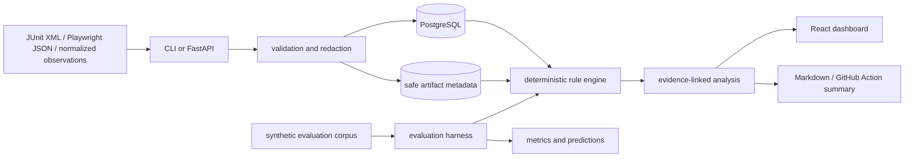

# Architecture

## Current system boundary

The backend is a modular monolith. Domain functions are independent of the HTTP layer so the API, CLI, Action, and evaluation harness can share the same deterministic implementation.

## Relational model

The first migration defines explicit tables for:

- projects;
- runs and run completeness;
- logical test executions/attempts;
- safe artifact descriptors;
- immutable evidence excerpts and locators;
- failures and versioned fingerprints;
- analysis revisions;
- review events; and
- durable leased jobs.

Important invariants are represented directly: a retry attempt is not an independent run; skipped is not passed; partial scope remains partial; and analysis revisions do not overwrite evidence or review history.

## Analysis flow

1. Normalize current-run observations and redact declared sensitive classes.
2. Persist the run, execution, artifact descriptor, and evidence location.
3. Create a strict fingerprint from normalized exception/message/status/route/selector/assertion features.
4. Retrieve only prior history for the same project/fingerprint.
5. Apply versioned rules and contradiction policy.
6. Abstain when evidence cannot distinguish categories safely.
7. Persist confidence kind, score explanation, supporting/contradictory evidence, missing evidence, hypotheses, investigation steps, policy flags, and reproducibility provenance.

The score is a `heuristic_score`, not a calibrated probability.

## Durable jobs

The `jobs` table supports queued/running/succeeded/partial/failed/cancelled/dead-lettered states, lease ownership, lease expiry, bounded attempts, stale-lease recovery, and backoff. The current worker executes a `noop` proof path; ingestion/analysis are still synchronous in this revision and must be moved behind jobs in a later milestone.

## Deployment

`compose.yaml` defines PostgreSQL, API, worker, and dashboard services. PostgreSQL is not published to the host. The API and worker run as an unprivileged user. Nginx supplies CSP, `nosniff`, and same-origin API proxying.
