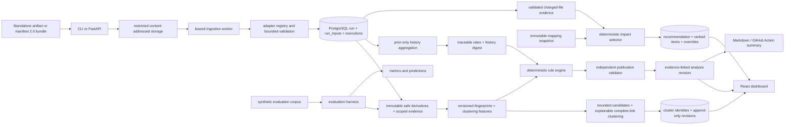

# Architecture

## Current system boundary

The backend is a modular monolith with separate API and worker processes. Domain functions are independent of HTTP so the API, CLI, Action and evaluation harness use the same normalization and deterministic analysis implementation.

## Multi-artifact ingestion

Manifest `2.0` declares stable input IDs, kinds, paths, required/optional scope, optional expected digests, media types and producer metadata. The versioned adapter registry resolves each input independently. One bad optional artifact does not erase valid siblings; a bad or absent required input makes the run partial and remains persisted for review.

Completeness is calculated from required **inputs**, never from the number of test observations. Parsed observation count is separate metadata. Input states are:

- `accepted`: safe structured/text evidence was parsed;
- `restricted`: bytes were accepted but are not safe for general display, such as screenshots/traces;
- `missing`: a required manifest path was absent;
- `rejected`: bytes existed but failed validation/parsing/digest checks;
- `unsupported`: a declared adapter kind is not recognized.

Schema `1.0` and one-report implicit ZIPs remain compatibility paths.

## Relational model

The migrations define explicit tables for:

- projects;
- durable ingestions and leased jobs;
- runs and run completeness;
- persisted per-run input scope/diagnostics (`run_inputs`);
- logical test executions/attempts plus run scope, environment, timezone, worker and shard cohort metadata;
- restricted artifact descriptors;
- immutable safe artifact derivatives and source maps;
- execution/input-scoped evidence observations and locators;
- failures and versioned fingerprints;
- failure clusters, append-only cluster revisions and revision-scoped memberships;
- reviewed cluster confirm/split/merge decisions with optimistic revision checks;
- immutable impact mapping snapshots, test definitions and typed mapping edges;
- deterministic impact recommendations, ranked selected/excluded items and append-only optimistic overrides;
- validated analysis revisions and validation audits; and
- append-only review events.

Important invariants are represented directly: a retry is not an independent run; skipped is not passed; a missing shard is not clean; a parse failure is not a product defect; partial scope stays partial; and analysis revisions do not overwrite evidence or prior review history.

## Analysis flow

1. Revalidate restricted source bytes and digest.
2. Resolve manifest/input scope and run each bounded adapter.
3. Redact or restrict evidence and persist input status/provenance.
4. Normalize test observations, create immutable content-addressed safe derivatives, and persist exact execution/input scope plus versioned locators/source maps.
5. Select only evidence authorized for the current failure; never use every evidence row in the run.
6. Re-read and validate derivative bytes, source/derivative digests, locator bounds, exact excerpt, typed observation and approval state.
7. Create strict fingerprints and a separate loose clustering view from normalized exception/message/status/route/selector/assertion/stack/browser features.
8. Generate bounded candidates from stable blocking signals, then calculate explicit matching, conflicting and weighted score components.
9. Build clusters conservatively: a candidate must satisfy both the representative threshold and the complete-link floor against every existing member. This prevents weak transitive A–B–C bridge merges.
10. Persist deterministic cluster identities, representative failures, uncertainty flags, member scores and append-only revisions. Reviewed confirm/split/merge corrections create new revisions rather than rewriting history.
11. Retrieve prior executions for the exact project/repository/framework/test/suite/path/parameter identity. Collapse retries per run/browser cohort; expose explicit outcome counts, denominators, uncertainty intervals, sequences and cohort breakdowns; exclude current/future data and later reviews; and persist the versioned history digest/cutoff in analysis provenance. Known-flake support requires compatible full-suite passes and failures plus a qualifying prior reviewed matching fingerprint. Cluster similarity does not prove causality and cannot override contradictory current-run evidence.
12. Independently validate each typed claim's evidence references and semantic support; withhold invalid claims and safely degrade unsupported classifications.
13. Persist confidence, supporting/contradictory evidence, missing evidence, hypotheses, validation audit, investigation steps, policy flags and reproducibility provenance.

The score is a `heuristic_score`, not a calibrated probability.

## Historical intelligence boundary

History is computed from persisted observations rather than a failure-only table. One run/browser cohort contributes one independent first/final outcome. Retries are never counted as separate runs, absent tests are not passes, and skipped/cancelled/unknown outcomes remain explicit. Run scope (`full_suite`, `impact_selected`, `unknown`) is part of the cohort contract so selected-subset evidence cannot silently create reassuring population rates.

The API may explore browser, branch, environment, run-scope, worker, shard and timezone-aware time buckets, but the analyzer uses the same browser/environment and full-suite history only. Every calculation is bounded by an immutable cutoff and produces a canonical digest over policy, filters, observations and prior review IDs. Human review annotates observed outcomes; it does not rewrite them.

## Change-impact boundary

Impact selection consumes two explicit, versioned inputs: a run-scoped changed-file record with validated base/head provenance and a project-scoped immutable mapping snapshot. Mapping edges identify their source (`file_to_test`, coverage, API/ownership, historical relation, dependency or mandatory policy) and version rather than hiding selection behind a free-form model label.

The selector normalizes paths, preserves old and new names for renames/deletions, performs bounded cycle-safe reverse dependency traversal, and records every contributing edge and reason. Mandatory smoke, security, transaction and critical tests are added independently of ranking. Tests not selected remain persisted with exclusion reasons so a small subset is inspectable rather than opaque.

The fail-safe state is broad execution. Self-reported trust, missing or mismatched base/head values, incomplete/truncated change lists, unmapped paths, stale mappings and critical shared/auth/authorization/ledger/migration/dependency/CI/test-infrastructure changes force `FULL_SUITE_REQUIRED`. Recommendations never mutate test execution. Reviewer overrides append a new attributed revision; stale writes fail, and mandatory/critical exclusions are rejected.

Artifact content cannot grant itself trust. A producer-provided trust label is retained only as declared metadata; effective comparison trust is supplied by the validated transport boundary and defaults to `self_reported`.

## Explainable clustering boundary

Clustering has two separate identities:

- a strict fingerprint for highly similar observations and deduplication; and
- a loose, readable feature view for candidate generation and similarity scoring.

Candidate generation uses bounded blocks such as strict fingerprint, exception family, canonical route, selector, assertion, leading stack frame and selected normalized message tokens. Common exception/token blocks are capped so the runtime does not silently become an all-pairs comparison.

Scoring retains both positive and negative evidence. HTTP authorization failures cannot merge with server failures merely because they share a route; generic timeouts cannot bridge different selectors; assertion direction and negation remain causally material. Cross-browser reproduction contributes only after stronger non-browser evidence exists. Singleton and uncertain clusters remain visible.

The cluster tables record the algorithm and feature versions, representative failure, score summary, uncertainty flags, revision-scoped memberships, score components, candidate reasons, matching/conflicting signals and human decision history. A cluster means “joint investigation candidate,” not “proven shared root cause.” No upstream/downstream causal edge is inferred from timing alone.

## Durable jobs

The `jobs` table supports queued/running/succeeded/partial/failed/cancelled/dead-lettered states, lease ownership, heartbeat/expiry, bounded attempts, stale-lease recovery and backoff. The ingestion worker reads stored bytes, parses all declared inputs, transactionally publishes a run, automatically analyzes failures, and safely replays after crash points without duplicating the run.

## Deployment

`compose.yaml` defines PostgreSQL, API, worker and dashboard services. PostgreSQL is not published to the host. API and worker run as an unprivileged user. Nginx supplies CSP, `nosniff` and same-origin API proxying.
