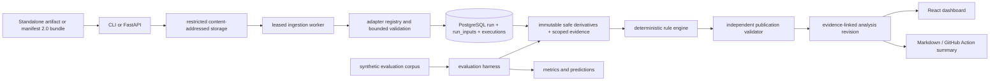

# Architecture

## Current system boundary

The backend is a modular monolith with separate API and worker processes. Domain functions are independent of HTTP so the API, CLI, Action and evaluation harness use the same normalization and deterministic analysis implementation.

## Multi-artifact ingestion

Manifest `2.0` declares stable input IDs, kinds, paths, required/optional scope, optional expected digests, media types and producer metadata. The versioned adapter registry resolves each input independently. One bad optional artifact does not erase valid siblings; a bad or absent required input makes the run partial and remains persisted for review.

Completeness is calculated from required **inputs**, never from the number of test observations. Parsed observation count is separate metadata. Input states are:

- `accepted`: safe structured/text evidence was parsed;
- `restricted`: bytes were accepted but are not safe for general display, such as screenshots/traces;
- `missing`: a required manifest path was absent;
- `rejected`: bytes existed but failed validation/parsing/digest checks;
- `unsupported`: a declared adapter kind is not recognized.

Schema `1.0` and one-report implicit ZIPs remain compatibility paths.

## Relational model

The migrations define explicit tables for:

- projects;
- durable ingestions and leased jobs;
- runs and run completeness;
- persisted per-run input scope/diagnostics (`run_inputs`);
- logical test executions/attempts;
- restricted artifact descriptors;
- immutable safe artifact derivatives and source maps;
- execution/input-scoped evidence observations and locators;
- failures and versioned fingerprints;
- validated analysis revisions and validation audits; and
- append-only review events.

Important invariants are represented directly: a retry is not an independent run; skipped is not passed; a missing shard is not clean; a parse failure is not a product defect; partial scope stays partial; and analysis revisions do not overwrite evidence or prior review history.

## Analysis flow

1. Revalidate restricted source bytes and digest.
2. Resolve manifest/input scope and run each bounded adapter.
3. Redact or restrict evidence and persist input status/provenance.
4. Normalize test observations, create immutable content-addressed safe derivatives, and persist exact execution/input scope plus versioned locators/source maps.
5. Select only evidence authorized for the current failure; never use every evidence row in the run.
6. Re-read and validate derivative bytes, source/derivative digests, locator bounds, exact excerpt, typed observation and approval state.
7. Create strict fingerprints from normalized exception/message/status/route/selector/assertion features and retrieve only prior history for the same project/fingerprint.
8. Apply versioned deterministic rules and contradiction policy to validated evidence only.
9. Independently validate each typed claim's evidence references and semantic support; withhold invalid claims and safely degrade unsupported classifications.
10. Persist confidence, supporting/contradictory evidence, missing evidence, hypotheses, validation audit, investigation steps, policy flags and reproducibility provenance.

The score is a `heuristic_score`, not a calibrated probability.

## Durable jobs

The `jobs` table supports queued/running/succeeded/partial/failed/cancelled/dead-lettered states, lease ownership, heartbeat/expiry, bounded attempts, stale-lease recovery and backoff. The ingestion worker reads stored bytes, parses all declared inputs, transactionally publishes a run, automatically analyzes failures, and safely replays after crash points without duplicating the run.

## Deployment

`compose.yaml` defines PostgreSQL, API, worker and dashboard services. PostgreSQL is not published to the host. API and worker run as an unprivileged user. Nginx supplies CSP, `nosniff` and same-origin API proxying.
